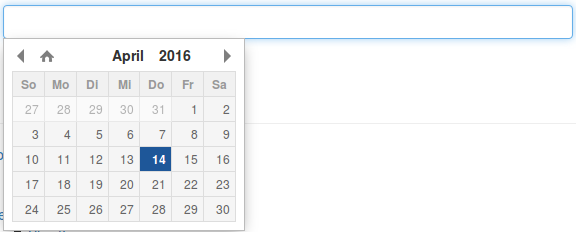
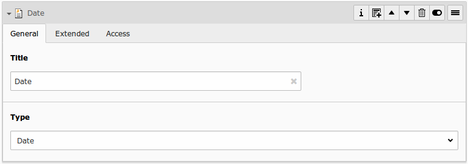
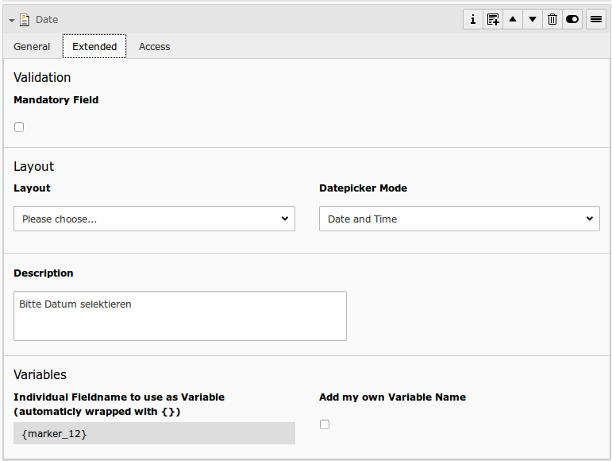

# Date

## What does it do?

- **General:** Do you want to render a datepicker for date (or datetime or time), you can use this field type. Per default html5 date fields are used with a JavaScript fallback. If you want to force the JavaScript Datepicker, you can use TypoScript. Dateformat will change by the frontend language. You can use TypoScript to use any dateformat (locallang.xlf).

## Frontend Output Example



## Backend Configuration Example





## Explanation

| Field | Description | Explanation | Tab |
|------------------------------------|-----------------------------------------------------------------------------------|--------------------------------------------------------------------------------------------------------------------------------------------------------------------------------------------------------------------------|----------|
| Title | Add a label for this field. | The label is shown in the frontend near to this field. | General |
| Type | Choose a fieldtype. | See explanation below for a special fieldtype. Different fields are  related to some fieldtypes – not all fields are shown on every type. | General |
| Mandatory Field | This field must contain input. | Check this if the field must contain input, otherwise submitting the form is not possible. | Extended |
| Layout | Choose a layout. | This adds a CSS-Class to the frontend output. Administrator can add, remove or rename some of the entries. | Extended |
| Datepicker Mode | Choose Date, Datetime or Time | Choose the frontend datepicker with date only, time only or a mix of both | Extended |
| Description | Add a description for this field. | Per default a description will be rendered as title-attribute in the labels in frontend. | Extended |
| Variables – Individual Fieldname | This is a marker of this field. | Use a field variable with {marker} in any RTE or HTML-Template. The marker name is equal in any language. | Extended |
| Add own Variable | Check this, if you want to set your own marker (see row before). | After checking this button, TYPO3 ask you to reload. After a reload, you see a new field for setting an own marker. | Extended |
| Language | Choose a language. | Choose in which frontend language this record should be rendered. | Access |
| Hide | Disable the form | Enable or disable this record. | Access |
| Start | Startdate for this record. | Same function as known from default content elements or pages in TYPO3. | Access |
| Stop | Stopdate for this record. | Same function as known from default content elements or pages in TYPO3. | Access |

## Date Formats

If you use a browser, that support modern date fields (e.g. Chrome),
JavaScript Datepicker will not be loaded by default.
In this case the Browser takes the configured language of the OS to set the date-format automaticly.
There is no change to define another dateformat.

But it's possible to enforce the JavaScript Datepicker even in Chrome with a line of TypoScript Constants:

`plugin.tx_powermail.settings.misc.forceJavaScriptDatePicker = 1`

Beside that, you can define the dateformat for the JavaScript Datepicker.
Depending on the datepicker settings (date, datetime, time), there are different entries in the locallang files.
You can overwrite that via TypoScript:

```
plugin.tx_powermail {
    _LOCAL_LANG {
        default {
            datepicker_format_date = Y/m/d
            datepicker_format_time = Y/m/d H:i:s
            datepicker_format_datetime = H:i:s
        }
        fr {
            datepicker_format_date = Y/m/d
            datepicker_format_time = Y/m/d H:i:s
            datepicker_format_datetime = H:i:s
        }
    }
}
```
