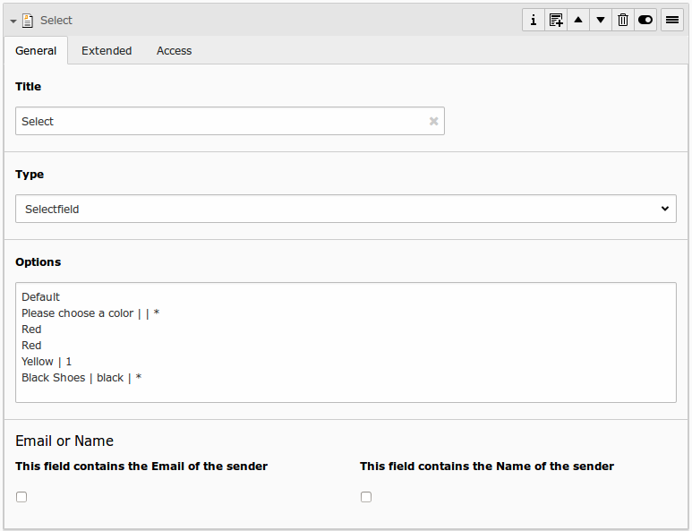
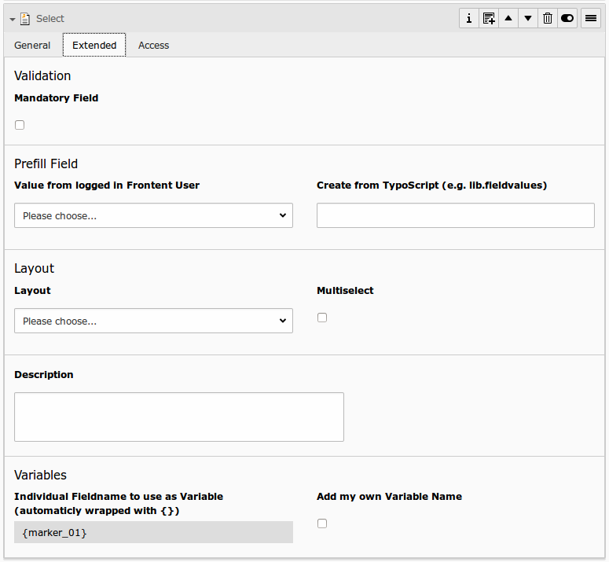

# Selectfield

## What does it do?

- **General:** A select field is also called "dropdown", "combobox" or "picklist". The user can choose an option. It's also possible to config a multiselectfield - the user can choose more than only one option by holding the CRTL-Key when clicking a second option. Add some options and separate it with a new line.
- **Mandatory:** This field could be marked as mandatory, so the user must fill out this field, otherwise the form can not be submitted.
- **Prefill:** The field can be preselected from FlexForm, TypoScript, GET/Post-Params or from FE_User table.
- **Special:** Options could also filled by TypoScript in powermail 2.1 and higher (static or dynamic)

## Frontend Output Example

Default:

Multiple:

## Backend Configuration Example

## Explanation

| Field | Description | Explanation | Tab |
|------------------------------------|-----------------------------------------------------------------------------------|--------------------------------------------------------------------------------------------------------------------------------------------------------------------------------------------------------------------------|----------|
| Title | Add a label for this field. | The label is shown in the frontend near to this field. | General |
| Type | Choose a fieldtype. | See explanation below for a special fieldtype. Different fields are  related to some fieldtypes – not all fields are shown on every type. | General |
| Options | Options to select | Separate each with a new line. **Note: see following table for examples, how to preselect or clean a value** | General |
| Email of sender | Check this if this field contains the email of the sender. | This is needed to set the correct sender-email-address. If there is no  field marked as Senderemail within the current form, powermail will use a  default value for the Senderemail. | General |
| Name of sender | Check this if this field contains the name (or a part of the name) of the sender. | This is needed to set the correct sender-name. If there is no field  marked as Sendername within the current form, powermail will use a  default value for the Sendername. | General |
| Mandatory Field | This field must contain input. | Check this if the field must contain input, otherwise submitting the form is not possible. | Extended |
| Value from logged in Frontend User | Check if field should be filled from the FE_Users table of a logged in fe_user. | This value overwrites a static value, if set. | Extended |
| Create from TypoScript | Fill Options from TypoScript | If you want to create your options (see above) from TypoScript, you can use this field. Please split each line in your TypoScript with [\\n]  Example: lib.options = TEXT lib.options.value = red[\\n]blue[\\n]pink (see more examples below) | Extended |
| Layout | Choose a layout. | This adds a CSS-Class to the frontend output. Administrator can add, remove or rename some of the entries. | Extended |
| Description | Add a description for this field. | Per default a description will be rendered as title-attribute in the labels in frontend. | Extended |
| Multiselect | Choose a layout. | This adds a CSS-Class to the frontend output. Administrator can add, remove or rename some of the entries. | Extended |
| Variables – Individual Fieldname | This is a marker of this field. | Use a field variable with {marker} in any RTE or HTML-Template. The marker name is equal in any language. | Extended |
| Add own Variable | Check this, if you want to set your own marker (see row before). | After checking this button, TYPO3 ask you to reload. After a reload, you see a new field for setting an own marker. | Extended |
| Language | Choose a language. | Choose in which frontend language this record should be rendered. | Access |
| Hide | Disable the form | Enable or disable this record. | Access |
| Start | Startdate for this record. | Same function as known from default content elements or pages in TYPO3. | Access |
| Stop | Stopdate for this record. | Same function as known from default content elements or pages in TYPO3. | Access |

## Option examples for selectbox

<table>
    <tr>
        <td>Example option</td>
        <td>HTML Output</td>
    </tr>
    <tr>
        <td>Red</td>
        <td>&lt;option value=”Red”&gt;Red&lt;/option&gt;</td>
    </tr>
    <tr>
        <td>Yellow | 1</td>
        <td>&lt;option value=”1”&gt;Yellow&lt;/option&gt;</td>
    </tr>
    <tr>
        <td>Blue |</td>
        <td>&lt;option value=””&gt;Blue&lt;/option&gt;</td>
    </tr>
    <tr>
        <td>Black Shoes | black | *</td>
        <td>&lt;option value=”black” selected=”selected”&gt;Black Shoes&lt;/option&gt;</td>
    </tr>
    <tr>
        <td>White | | *</td>
        <td>&lt;option value=”” selected=”selected”&gt;White&lt;/option&gt;</td>
    </tr>
    <tr>
        <td>
            Please choose... | 
            red 
            blue
        </td>
        <td>&lt;option value="">Please choose...&lt;/option&gt;&lt;option&gt;red&lt;/option&gt;&lt;option&gt;blue&lt;/option&gt;</td>
    </tr>
</table>
